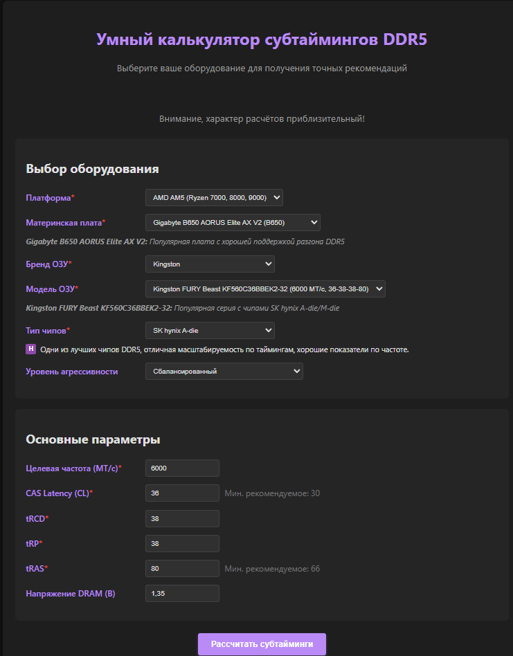

# DDR5 Timing Calculator ⭐

  

🛠️ **Умный калькулятор субтаймингов DDR5** для ручной настройки памяти.  
✅ Поддержка SK hynix A-die/M-die, Samsung B-die, Micron E/F-die  
✅ Авто-проверка стабильности таймингов  
✅ Расчёт **реальной задержки в наносекундах** (не только такты!)  

---

## 🔥 Почему это лучше XMP/EXPO?
| Показатель | XMP/EXPO | Наш калькулятор |
|------------|----------|-----------------|
| **CAS Latency** | 36 тактов | 30 тактов (10.0 нс) |
| **tRCD/tRP** | 38 тактов | 36 тактов (12.0 нс) |
| **Реальная задержка** | 12.0 нс | 10.5 нс |
| **Гибкость** | Жёсткие профили | Полный ручной контроль |

  
*Интерфейс калькулятора с поддержкой Gigabyte B650 и SK hynix A-die*

---

## 🌐 Как использовать?
1. Откройте [онлайн-версию](https://XXNessIXX.github.io/DDR5-Timing-Calculator)
2. Выберите ваше оборудование:
   - Материнскую плату (Gigabyte B650, ASUS X670 и др.)
   - Тип чипов (SK hynix A-die, Samsung B-die и др.)
3. Настройте тайминги (CL, tRCD, tRP, tRAS)
4. Получите рекомендации по субтаймингам и напряжениям

---

## 💡 Успешные конфигурации от пользователей
✅ **Gigabyte B650 + SK hynix A-die**  
`DDR5-6000 30-38-38-50` | DRAM 1.38В | SOC 1.20В | 12h TestMem5 OK  

✅ **ASUS X670E + Samsung C-die**  
`DDR5-6400 32-36-36-76` | DRAM 1.42В | 24h Prime95 Pass  

> 💬 *"Этот калькулятор помог мне запустить DDR5-6000 с таймингами 28-36-36-48! Спасибо!"*  
> — Пользователь с TechPowerUp, июль 2025

---

### ⭐ Помогите проекту развиваться!
Поставьте звезду на GitHub — это **главный сигнал для поиска** и мотивация для новых фич!  

---

🛠️ **Создано с помощью [GitHub Pages](https://pages.github.com/)**  
